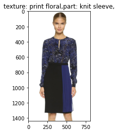
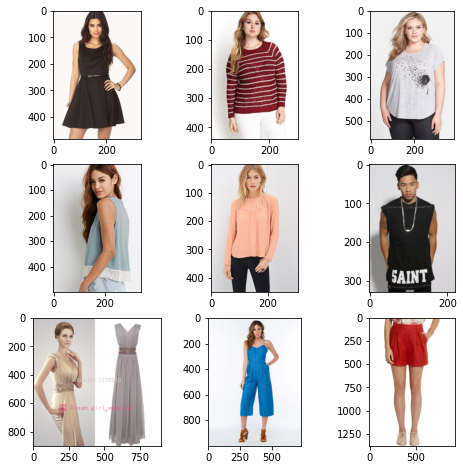

# flipkart_grid_2020

Flipkart Grid challenge 2020 Fashion Intelligence Systems

## Documentation

<a href='https://oke-aditya.github.io/fashion_intel/'>Click here for documentation</a>

## Sample Outputs

### Fashion Tagger

### Fashion Ranker

