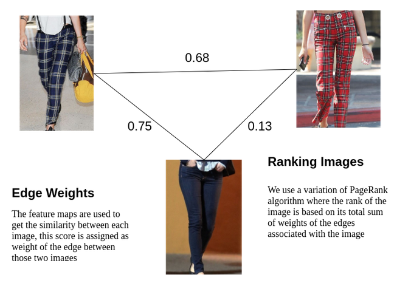

# Fashion Ranking 

## Overview

The fashion trend can be analyzed in two ways
- From supervised data from e-commerce sites
- unsupervised data from catalogues and social media

Hence we have two ranking algorithms for these two cases

##  Unsupervised Fashion Ranking

We developed a graph based ranking algorithm to get a score for each fashion image

This algorithm can identify communities of nodes in a graph based on the edges connecting them.

### How it works

- The Fashion2Vec vectors of each fashion image is used to build a fully connected graph
- In this graph each node is an image
- The weight of each edge between two images is the similarity of the two images (we use euclidean distance)
- We then use a variation of PageRank algorithm to assign a score to each node
- This score is then normalized to be range of 0-100

This algorithm is somewhat similar to Spectral clustering, instead we use an algorithm to assign score to each image
Unlike clustering where all the images in a cluster will get similar score, in this approach each image is given a score by comparing it
with everyother image.

## Supervised Learning Algorithm

The data from e-commerce sites are a good indicator of what sells, moreover the data is labelled.

However the ratings by themselves arent a true measure of the products performance, and its not straightforward to compare the ratings of products from different sites

To overcome this we developed a formula to give a very accurate estimate of the product's true rating.
The score from our formula is agnostic of the e-commerce site from where it was taken, hence products from different e-commerce sites can 
be compared on a level field.

