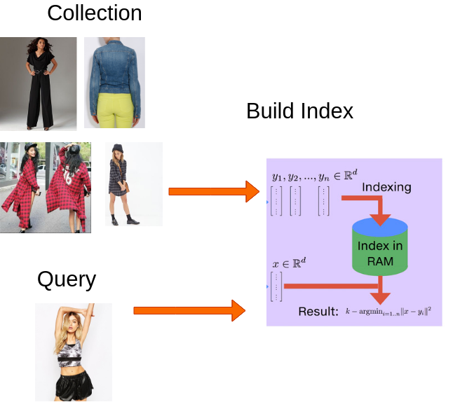

# Fashion Search Engine

## Overview

The vectors generated by Fashion2Vec needs to be indexed and efficiently searched so that they can be used for Fashion Reccomendation 
and Image searching

## FAISS

We used Facebook AI Similarity Search to implement this Visual Search Engine, the vectors are indexed and stored.
This index can be used to query similar vectors. The similarity index used in this project is Euclidean Distance

### Reccomendation Engine

Our reccomendation engine uses these indexes to show the user similar fashion items and their ranks when they click on any particular image.
This aids the user in Fashion Discovery

## Scope For Improvement

There are many highly scalable vector similarity search engines available , for example Milvus is one such engine we wanted to use. It internally uses FAISS but is highly optimized and scalable.